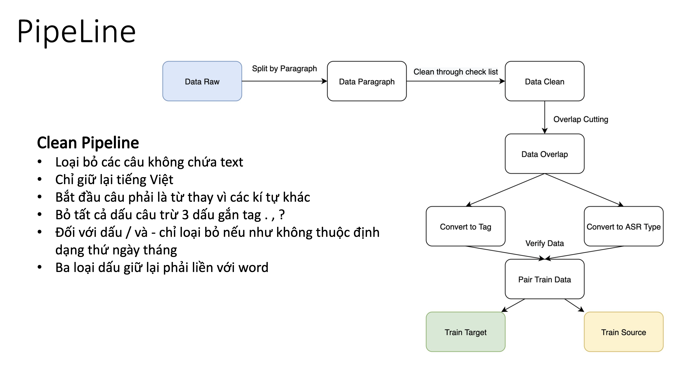

# Khôi phục viết hoa của tên riêng trong câu


Mô hình chuẩn hoá tên riêng

Ví dụ:
```text
input: ngày hôm nay quảng ninh nắng nóng độ ẩm cao
output: ngày hôm nay Quảng Ninh nắng nóng độ ẩm cao

input: sở tài nguyên và môi trường tỉnh bình dương cũng đề nghị phòng tài nguyên và môi trường huyện bến cát cùng các xã có liên quan tiến hành khảo sát
output: Sở Tài nguyên và Môi trường tỉnh Bình Dương cũng đề nghị Phòng Tài nguyên và Môi trường huyện Bến Cát cùng các xã có liên quan tiến hành khảo sát
```
## Quá trình làm sạch dữ liệu đầu vào
- Dữ liệu được lấy từ tập BinhVQ được chia thành các chủ đề *Kinh tế*, *Xã hội*, *Khoa học*,... Trong bài toán này chúng ta sử dụng năm chủ đề *Kinh Tế*, *Văn Hoá*, *Xã Hội*, *Pháp Luật*, *Thế Giới*. 

- Dữ liệu tại mỗi chủ đề được chia thành dạng đoạn văn, trong đó có rất nhiều các kí tự không cần thiết gây nhiễu loạn dữ liệu. Hình bên dưới đưa ra quá trình làm sạch dữ liệu với các yêu cầu cụ thể:



## Chuẩn bị dữ liệu gốc


Xây dựng bộ từ điển theo dạng nhị phân từ dữ liệu huấn luyện

- chạy lệnh 
```text
bash run_prepare_data.sh
```

- Đảm bảo rằng tại dòng *373* và *374* chứa đường dẫn tới dữ liệu gốc và tên của các tập này phải là `train` và `valid`

***Lưu ý:***

Việc chuẩn bị dữ liệu chỉ cần chạy một lần khi chúng ta khởi tạo hoặc thêm mới dữ liệu. Trong code hiện tại dữ liệu đã được lưu tại `/data/processed/nlp/capu-vn/data-bin/vlsp/raw` và phần sau khi xử lý xong sinh ra các file nhị phân và từ điển tại `/data/processed/nlp/capu-vn/data-bin/vlsp/preprocessed`.


## Huấn luyện mô hình trên local
- Để huyến luyện mô hình, đầu tiên ta cần kiểm tra đường dẫn tại dòng *26* đã đúng với đường dẫn dữ liệu đã được xử lý ở phần trên chưa:
- Sau đó chạy lệnh:
```text
python train.py
```

## Chạy model trên local
- Truyền vào một tệp :

```text
python infer_exp.py *input_file* *output_file*
```


- Ví dụ: 
```text
python infer_exp.py evaluate/eval_indomain_full_17k.src evaluate/eval_indomain_full_50M_17k.hyp
```

- Truyền vào một câu một:
```text
python infer.py
```

## Service

`Docker image`: "Đường dẫn đến docker image"


Chạy các lệnh:
```
docker-compose up
```
để khởi tạo docker

sau đó 
```
run_infer.sh
```
để truyền nội dung 

***Ví Dụ***
```bash

curl -i -H "Content-Type: application/json" -X POST -d '{"input_string":"ngày hôm nay quảng ninh nắng nóng độ ẩm cao"}' http://localhost:4445/capu

```
```commandline
{"output_string": "ngày hôm nay Quảng Ninh nắng nóng độ ẩm cao"}
```

